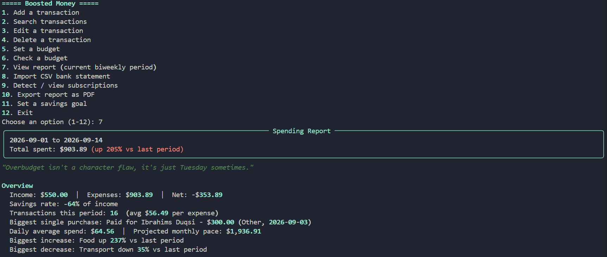
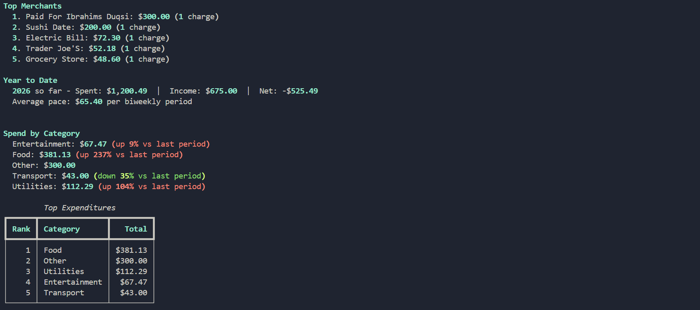
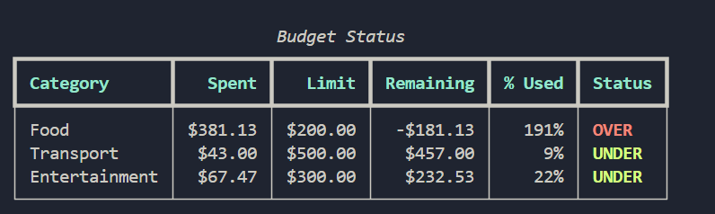
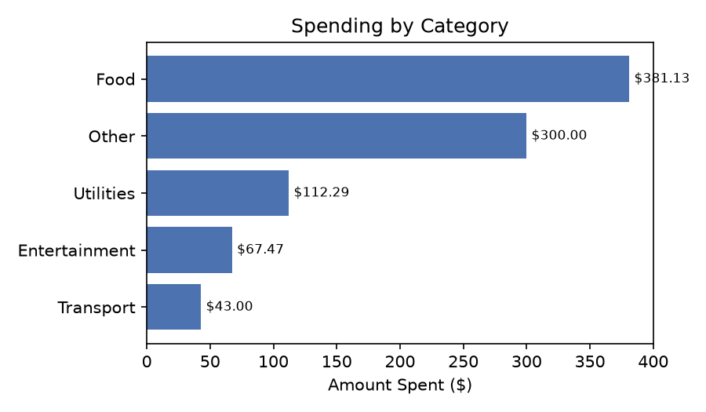
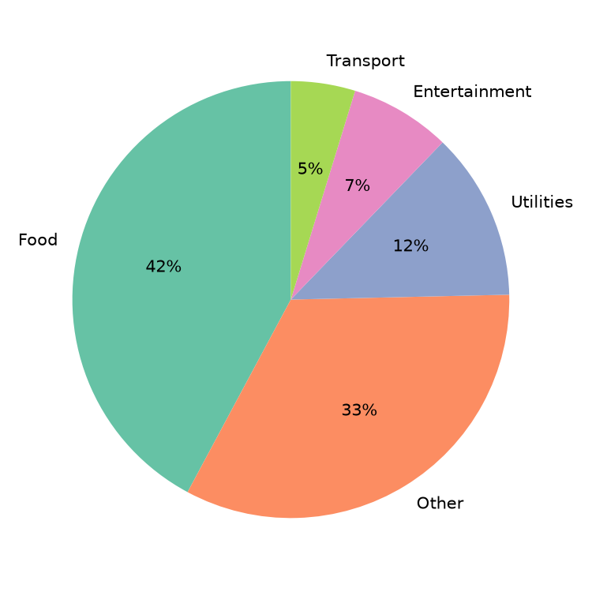
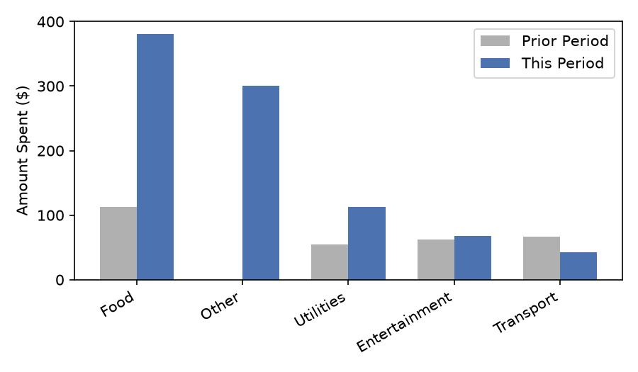
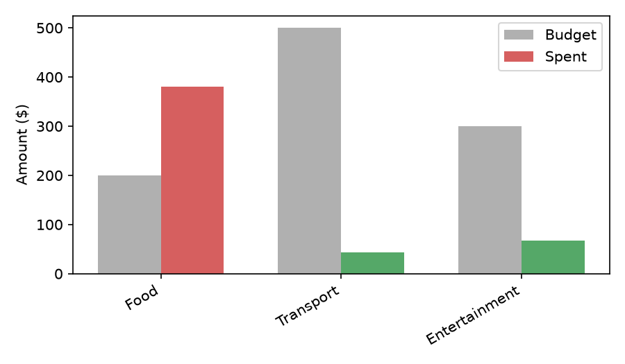

# BOOSTED Money

A terminal-based personal finance tracker. Log transactions, set budgets, import bank CSVs, catch recurring subscriptions, compare spending period-over-period, track savings goals, and export a full spending report as a PDF — all from a simple numbered menu.

## Screenshots

**Main menu & spending report overview**


**Top merchants, year-to-date totals, and category breakdown**


**Budget status**


**Exported PDF report**

Option 10 exports the full report as a formatted PDF with charts:

| Spending by category | Spending breakdown |
|---|---|
|  |  |

| Period comparison | Budget vs. actual |
|---|---|
|  |  |

## Features

- **Transactions** — add, search, edit, and delete transactions
- **Budgets** — set per-category budgets and check status (under / at / over)
- **Reports** — biweekly spending report with totals, category breakdown, top expenditures, and a rotating financial "saying" based on your mood tier
- **CSV import** — import a bank statement, auto-map columns, guess categories by merchant keyword, and skip rows already imported
- **Recurring detection** — flags merchants charging consistent amounts on a regular interval as active subscriptions
- **Trends** — compares the current period against the prior period, category by category
- **Stats** — income vs. expenses, savings rate, daily average spend, projected monthly pace, biggest movers, merchant leaderboard, year-to-date summary
- **Savings goals** — set a goal and track progress based on net savings since creation
- **PDF export** — turn any report into a shareable PDF with charts


## Setup

```bash
git clone https://github.com/OmarAsis/BOOSTED-Money.git
cd BOOSTED-Money
python3 -m venv venv
source venv/bin/activate     # Windows: venv\Scripts\activate
pip install pandas matplotlib fpdf2 rich pytest
```

## Usage

```bash
python main.py
```

Then pick an option from the menu (1–12) to add transactions, check budgets, view or export a report, import a CSV, and so on.

## Running tests

```bash
pytest tests.py -v
```

## Notes

- `venv/`, `data/`, `__pycache__/`, and `check_db.py` are git-ignored — see `.gitignore`.
- The report's "mood" and financial saying are derived from budget status and spending trend, not hardcoded per period.